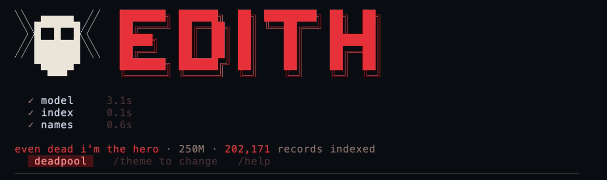

# EDITH



A 250M-parameter GPT, trained from scratch on a Marvel corpus, wrapped in a
retrieval system, answering questions in a terminal.

**Most of what EDITH says never touches the 250M weights.** A question
resolves to a record in a BM25 + entity-resolution index; if the record has
the field the question asks for, EDITH renders it directly, in code, in a
few milliseconds. The model only writes the parts no field can answer -
"what happened in Civil War," not "who created Iron Man." If you were
expecting a chatbot that memorised Marvel and judge it as one, it will look
small and patchy. Judged as what it is - a fact-composition system with a
small model filling the gaps - the honest description is also the more
interesting one.

## What it looks like

```
even dead i'm the hero · 250M · 202,171 records indexed
  [plain]   /theme to change   /help
──────────────────────────────────────────────────────────────────────────────

▌ you
  who is curtis connors

  ▸ searched 202,171 records — 1 caught · 2 ms

▌ edith
  Curtis Connors  [Earth-616]

    Powers            None. Connors no longer has powers after being separated
                      from his Lizard persona.; Bulletproof; Shapeshifting
    Created by        Stan Lee; Steve Ditko
    First appearance  Amazing Spider-Man Vol 1 6
    Occupation        College professor; herpetologist; lead researcher in
                      bio-genetics; fugitive

  ◈ 1 source  ·  ⧗ 2 ms  ·  from the record
```

That answer involved no model at all. The footer says so: `from the record`,
2 ms, one source. In colour, with one of six character themes, it looks
considerably better than a code block can show:


Boot, `who is curtis connors`, `/theme moon-knight`, `who is marc spector`.
A theme changes the colour, the emblem, the rule, the retrieval verb and the
speaker's name - never an answer.

## Install

```bash
uv tool install git+https://github.com/Tomionkkas/edith
edith
```

Identical on Windows, macOS and Linux. [uv] brings its own Python, so there
is no question of which `python3` is first on your PATH - the launcher it
writes has the right interpreter baked into it, and on Windows it is an
`edith.exe`.

The first `edith` asks before it downloads anything: the fp16 weights
(508 MB) and the corpus (296 MB) from Hugging Face, ~804 MB together, then
it rebuilds the retrieval index locally in about 30 seconds. The index is
never downloaded - it is a pickle, and unpickling executes arbitrary code,
so it is cheaper and safer to rebuild it.

EDITH runs on the CPU. That is the default and, for most of what it does,
the whole story: an answer composed from a retrieved record never reaches
the model at all and lands in a few milliseconds. Only the questions no
field can answer are generated, and those take a couple of seconds. If you
have an NVIDIA card and want them faster, add `--torch-backend=auto` to the
install command above and uv will fetch a CUDA build instead.

All of that lands in `~/.edith` (`C:\Users\you\.edith` on Windows) - one
directory, one thing to delete. `EDITH_HOME` moves it.

To work on EDITH rather than use it, clone instead:

```bash
git clone https://github.com/Tomionkkas/edith
cd edith
uv venv
uv pip install .
```

That puts the dependencies and the `edith` command in `.venv`. To run the
code you are editing rather than the installed copy:

```bash
uv run --no-project python infer/terminal.py
```

The first run offers to fetch the weights and corpus the same way, into the
same `~/.edith`.

`--no-project` is not optional, and neither `uv run` without it nor
`uv pip install -e .` will work. Both try an editable install, and hatchling
refuses one here: the wheel remaps `infer` to `_edith/infer`, and a `sources`
rewrite that changes a prefix rather than removing it is unsupported in dev
mode. Nothing needs it - every module is loaded by file path, so running the
clone is already running the code you changed.

[uv]: https://docs.astral.sh/uv/

## Use

```bash
edith                          # anywhere
edith --ask "who is thor"      # one question, then exit
edith --theme hulk             # start in a given skin
```

Inside the terminal: type a question. `/theme [name]` switches the skin
(six Marvel-character looks, plus `plain`) or lists them with none given.
When a question is genuinely ambiguous - eighteen different records are
headlined exactly "Spider-Man" - EDITH offers a picker instead of guessing;
arrow keys move it, Enter chooses, a bare number also works. `/help` lists
the rest (`/sources on|off`, `/history`, `/forget`, `/quit`).

Colour follows the terminal: 24-bit where it is supported, and the
256-colour palette everywhere else, which is what macOS Terminal.app gets.
`EDITH_COLOR=truecolor|256` forces it, for a terminal that reports neither
honestly. `NO_COLOR` turns it off entirely.

## How it works

**Corpus.** 202,171 records - characters, teams, locations, items, events,
comics - crawled from Marvel Database (marvel.fandom.com) and English
Wikipedia. Each record is two layers: schema lines (`Page:`, `Created by:`,
`Real name:`, `Codename:`, `Reality:`, ...) above prose under `History:`.

**Tokenizer.** A SentencePiece BPE, `marvel_bpe_50257`, trained on the
corpus, vocabulary 50,257.

**Two-stage pretrain.** Stage 1 trains on general English so the model can
speak. Stage 2 continues training on Marvel text alone, with a 30% replay
of stage 1's English mixed back in - dropping replay past that point buys
less Marvel knowledge per point of English forgotten (`MEASUREMENTS.md` §4).

**SFT.** Stage 3 instruction-tunes the stage-2 model on question/answer
pairs built from the same corpus, so it learns to answer rather than
continue text. Stage 2 has the lower perplexity of the two; stage 3 is what
ships, because continuing text is not answering a question.

**Retrieval.** A question resolves to a record through a BM25 index plus
entity resolution over every name and alias in the corpus (`retrieve/`).
When two records are within a measured confidence margin of each other -
"who is beast" genuinely could mean several things - EDITH asks rather than
guesses.

**Compose or generate.** If the resolved record has the field the question
needs, EDITH renders it directly from the record, in code - no model
involved. If it does not, the 250M model generates an answer with that
record in its prompt. The footer on every answer says which happened:

| footer | means |
|---|---|
| `from the record` | rendered directly from the record's fields, in code. No model involved. |
| `grounded` | the model generated the answer, with the record in its prompt. |
| `no source` | no record was found; the answer is a refusal, not a guess. |

## What it gets wrong

Two answers, quoted verbatim, from the published fp16 model:

> `what happened in civil war` → *"Civil War was created by Jonathan
> Hickman and Esad Ribić."*

That is a creator credit, not an account of what happened. The corpus has
no "what happened" field for an event's record - only `Created by:`,
`First appearance:`, and similar - so when the record cannot answer the
literal question, the model composes from the fields it does have, and the
result answers a different question than the one asked.

> `how did bruce banner become the hulk` → *"Bruce Banner became the Hulk
> after his transformation into the Hulk. He is from Earth-TRN1589."*

Circular, and it cites Earth-TRN1589 - an obscure alternate continuity, not
the mainline Bruce Banner a reader almost certainly meant.

Measured, not anecdotal:

- **`py infer/run_cases.py` scores 23/27** (`MEASUREMENTS.md` §6). The four
  failures - `who is cable` (missing a fact), `who is power man` and
  `who is spider-man 2099` (a picker offered when an answer was expected),
  `who is spider-man earth-1610` (a refusal when a picker was expected) -
  all resolve to the *correct* record; every failure is in how the answer
  was delivered, not which character was found.
- **The picker fires on 44% of famous "who is X" questions** (`who is
  thor` now offers ten Thor Odinson variants instead of answering), up from
  23% before codenames became primary names. A name with more primary
  owners narrows the confidence margin between the top two candidates, and
  a narrower margin trips the picker more often.
- **`doctor doom` returns the crawled Marvel Database record, not the
  hand-patched one** (`curated/patch.txt`) - the same character, but the
  patched card reads "Emperor Doom" and the crawled one does not. This is a
  known, un-fixed routing gap, not a missing record.
- **The corpus has a measured long tail**: about 2.7% of records have a
  headline reality marker (e.g. `(Earth-616)`) where the source page states
  no reality at all; 25 records have a malformed `Reality:` list; 34 records
  open on a bare pronoun instead of a name.

The numbers behind every item above are in `MEASUREMENTS.md`.

## Measurements

Three headline figures, all re-measured, full detail and reproduction
commands in `MEASUREMENTS.md`:

| measurement | result |
|---|---|
| Perplexity, stage 3, general / Marvel val | 38.22 / 18.59 |
| Retrieval round-trip / flagships | 97.5% (999 probes) / 40/40 |
| `run_cases.py` (what EDITH actually says) | 23/27 |

## Repository layout

| path | what |
|---|---|
| `infer/` | the terminal, the retrieval-to-answer engine, rendering, evaluation harnesses |
| `retrieve/` | the BM25 index, entity resolution, disambiguation |
| `train/` | the trainer, perplexity evaluation, tokenizer training, packing |
| `crawl/` | the Fandom and Wikipedia crawlers and curators that built the corpus |
| `release/` | safetensors conversion, the fp16/fp32 comparison, the export tool that built this tree |
| `tokenizer/` | `marvel_bpe_50257`, the trained BPE model in use |

The weights, the corpus and the two indexes are not in this repo and never
land in it: they are fetched or built into `~/.edith` on first run (see
`paths.py` and `bootstrap.py`). A clone from before that was true keeps
working - the artefacts beside it are moved in rather than downloaded again.

## Licenses and credit

The code is **MIT** (`LICENSE`). The corpus and any retrieval index built
from it are **CC BY-SA 4.0** (`LICENSE-DATA`) - inherited, not chosen: the
corpus is derived from Marvel Database and Wikipedia, both CC BY-SA, and
stores their prose close to verbatim, so it cannot be relicensed. Credit and
source detail: `ATTRIBUTION.md`.

## Disclaimer

EDITH is an independent project and is not affiliated with, endorsed by, or
sponsored by Marvel Entertainment, LLC or The Walt Disney Company.
